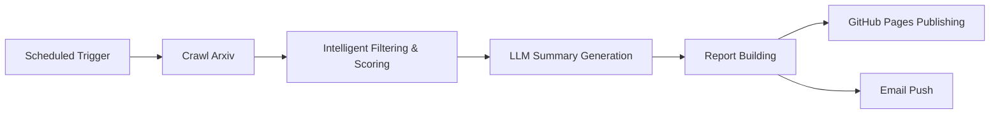

# 📚 LLM4ArxivPaper — Arxiv Paper Auto-Pusher Powered by LLM

**LLM4ArxivPaper** is an intelligent tool that automatically crawls, filters, summarizes, and generates paper reports based on your research interests.

The project regularly fetches the latest papers from Arxiv related to your research topics, uses LLM to generate summaries, and builds browsable weekly reports via **GitHub Pages**. It also supports **email push**.

Supports **Chinese and English report generation**, enabling a full workflow from auto-crawling → intelligent filtering → LLM summarization → report generation → email push.

>[中文 (README_zh.md)](README_zh.md)

Demo: [View here](https://yeren66.github.io/LLM4ArxivPaper)


---

## 🚀 Quick Start (about 10 min)

### 1. Fork the Repository

Fork this project to your personal GitHub account.

### 2. Enable GitHub Pages

Create a Pages site in your repository, see the official guide:

👉 [Create a GitHub Pages site](https://docs.github.com/en/pages/getting-started-with-github-pages/creating-a-github-pages-site)

### 3. Configure pipeline.yaml

Edit the pipeline.yaml file in the root directory. The minimal core configuration is as follows (detailed comments in the yaml file):

```yaml
language: "en"  # Report language (optional: zh-CN / en)
topics:
  - name: "software_testing"
    label: "software testing"
    query:
      categories: ["cs.SE", "cs.AI"]
      include: ["software testing", "test automation"]
      exclude: ["quantum", "biomedical"]
    interest_prompt: |
      I am interested in research on LLM-assisted software testing, especially new methods for test generation, coverage improvement, and defect localization.

recipients: ["xxx@example.com"]
base_url: "https://<github_username>.github.io/LLM4ArxivPaper"
```

> 💡 Tip: You can configure multiple topics, and the project will crawl and generate reports for each research direction.

------

### 4. Configure Secrets

Go to your repository:

**Settings → Secrets and Variables → Actions → New repository secret**

Add the following:

| Secret Name     | Description                  | Required |
|-----------------|-----------------------------|----------|
| API_KEY         | API key for LLM service      | ✅       |
| BASE_URL        | LLM API endpoint (default OpenAI) | ✅       |
| MAIL_USERNAME   | Gmail account (full address) | ⚠️ Email feature |
| MAIL_PASSWORD   | Gmail app password           | ⚠️ Email feature |

> 📧 [Get Gmail app password](https://support.google.com/mail/answer/185833)

If you do not enable email, you can omit MAIL_USERNAME and MAIL_PASSWORD. After execution, you can directly access the generated report at base_url (https://<github_username>.github.io/LLM4ArxivPaper).

------

### 5. Enable GitHub Actions

Go to **Settings → Pages** in your repository, and set **Source** to **GitHub Actions**.

------

### 6. Run the Script

You can manually trigger the workflow (pipeline-smoke) for testing, or wait for automatic execution every Monday (modify schedule in .github/workflows/weekly-pipeline.yml).

---

## 💼 How It Works

The project runs weekly and follows these steps:

1. Crawl new papers from Arxiv based on user-configured topics.
2. Filter papers intelligently (based on title, author, abstract, etc.), scoring for novelty, completeness, etc.
3. Filter out papers with scores below 60.
4. Use LLM to generate five-dimensional summaries for selected papers.
5. Build readable report pages and push to GitHub Pages.
6. (Optional) Send reports via email to specified recipients.

### 📄 LLM Summary Template Example

```
Please summarize this paper from the following 5 aspects:
1. What problem does it solve?
2. What solution is proposed?
3. What are the core methods/strategies? (detailed)
4. How is the experiment designed? Metrics, baseline, and dataset?
5. What are the conclusions?
```

After summarization, the LLM will also generate and answer several "extended questions" based on your research interests, providing more tailored insights.

### ⚙️ System Flowchart



---

## 🤝 Contributing

Contributions are welcome! Submit Issues or Pull Requests.

1. Fork this repository
2. Create a feature branch: git checkout -b feature/AmazingFeature
3. Commit your changes: git commit -m 'Add some AmazingFeature'
4. Push the branch: git push origin feature/AmazingFeature
5. Open a Pull Request 🎉

------

## 📄 License

This project is licensed under the **MIT License**

See [LICENSE](LICENSE) for details.

------

## 🙏 Acknowledgements

- [Arxiv](https://arxiv.org/) — Paper data source
- [GitHub Actions](https://github.com/features/actions) — Automation platform
- [OpenAI](https://openai.com) — Powerful LLM support

---


