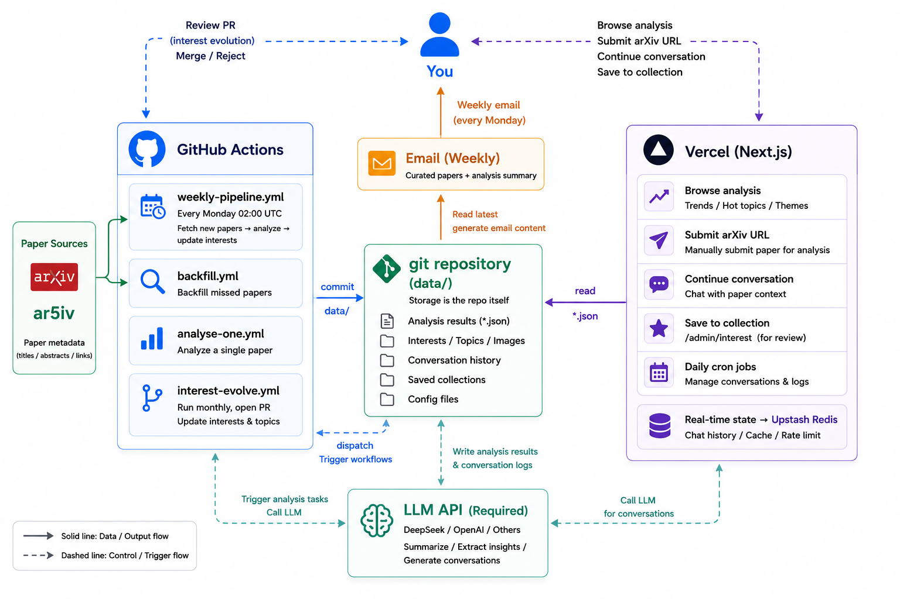
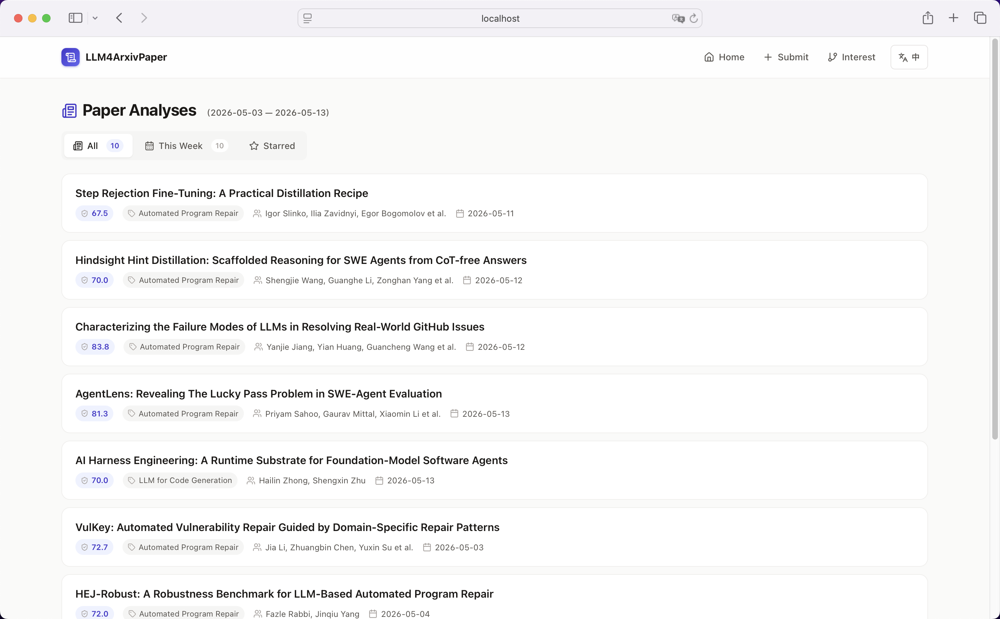
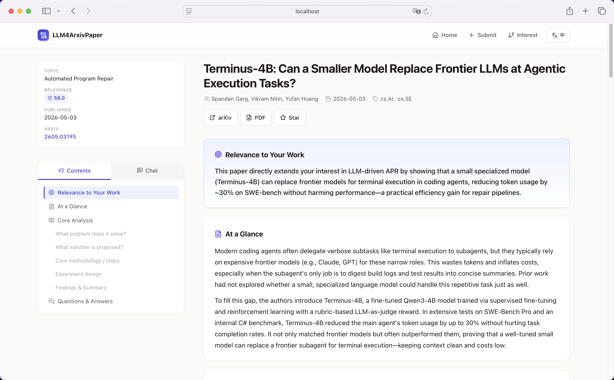
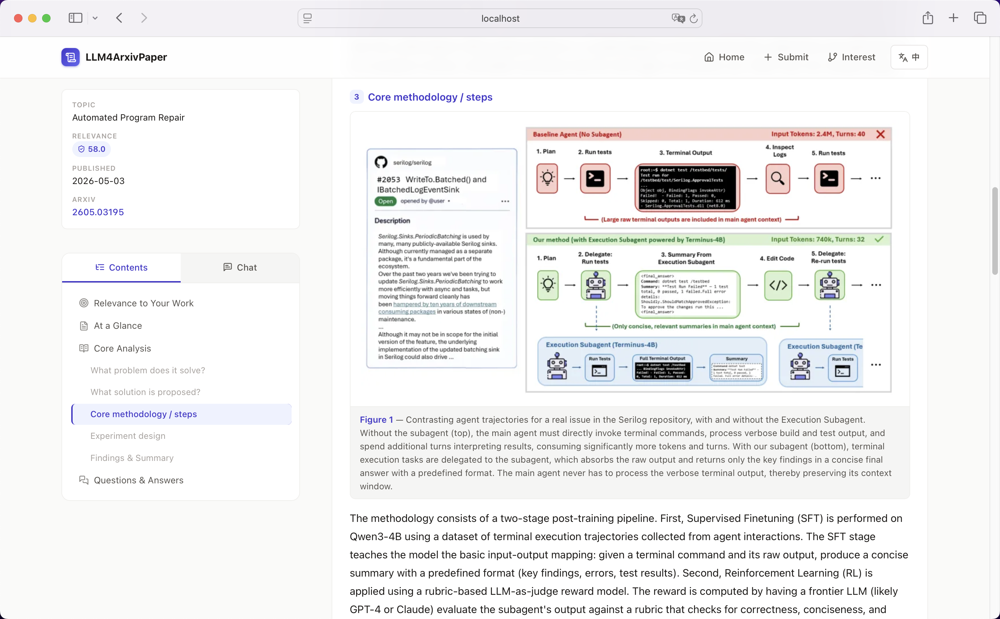

# LLM4ArxivPaper


[中文文档](docs/README_zh.md)

LLM4ArxivPaper crawls arXiv for papers in your research areas, runs an LLM analysis tailored to your interests, and serves the results through a web app and a weekly email. It has two parts: an analysis pipeline that runs on GitHub Actions, and a Next.js app deployed on Vercel.



## Features

- Works with any OpenAI-compatible endpoint (DeepSeek / OpenAI / Bailian / local vLLM); paper bodies come from ar5iv, so token cost stays low
- Relevance note: one or two sentences on how each paper connects to your research
- Five-aspect analysis (problem / solution / methodology / experiments / conclusion) plus interest-driven Q&A with quoted evidence
- Key figures extracted automatically (architecture and flow diagrams)
- On-demand analysis from a URL, plus chat with the paper's full context, history synced across devices
- Star papers you want to keep; hide the ones you're not interested in
- Backfill any historical date range
- A heartbeat commit dodges GitHub's 60-day auto-disable of scheduled workflows

## Screenshots

The home page lists every analysed paper, with tabs for all papers, the current week's run, and the ones you starred:



Each paper page opens with the relevance note (why this paper matters to *your* work) and the at-a-glance summary:



Below that is the five-aspect analysis. The method/architecture figure is pulled straight from the paper and embedded inside the methodology aspect:



## Install

```bash
# 1. Create your own private repo with this repo's "Use this template", then clone it
# 2. Validate your LLM config locally (~1-2 min)
pip install -r requirements.txt
API_KEY="sk-..." BASE_URL="https://api.deepseek.com/v1" \
  python src/main.py run --paper-limit 1
```

`--paper-limit 1` analyses one paper per topic. The terminal shows the crawl, scoring, and five-aspect analysis; a JSON file lands under `data/analyses/`. If this works, your LLM key, endpoint, and topic config are correct.

Then configure on GitHub:

1. **Settings → Secrets and variables → Actions**: add `API_KEY` and `BASE_URL`.
2. **Settings → Actions → General**: allow workflows to run.
3. Edit `config/pipeline.yaml` with your research areas:

```yaml
openai:
  api_key: "${API_KEY}"
  base_url: "${BASE_URL}"
  relevance_model: "deepseek-v4-flash"
  summarization_model: "deepseek-v4-flash"
  language: "zh-CN"          # analysis output language: zh-CN or en

topics:
  - name: "software_testing"
    label: "Software Testing"
    query:
      categories: ["cs.SE", "cs.AI"]
      include: ["test generation", "test update"]
      exclude: ["quantum"]
    interest_prompt: |
      I research LLM-assisted software testing, focused on test-case
      generation and fault localisation. I want to understand how LLMs
      and static analysis can be combined effectively.
```

4. **Actions → Weekly LLM4ArxivPaper Pipeline → Run workflow** for the first full run.

The pipeline writes `data/analyses/*.json`, committed to your repo. Those JSON files are the data source for the web app and the email. `language` controls the language of everything the LLM generates, applied at generation time.

## Deploy the web app

The web app provides browsing, on-demand URL analysis, chat, starring, and hiding papers you don't care about. It runs on Vercel.

1. Sign up for [Vercel](https://vercel.com) and import your repo as a project.
2. Project **Settings → General → Root Directory**: set to `web`.
3. Project **Storage → Browse Marketplace → Upstash Redis → Install**. Redis holds stars and chat history; its connection env vars are injected automatically.
4. Create a GitHub [fine-grained PAT](https://github.com/settings/tokens?type=beta) with `Actions: Read and write`, `Contents: Read and write`, `Metadata: Read`, scoped to your instance repo only.
5. Project **Settings → Environment Variables**:

| Variable | Value | Required |
|---|---|---|
| `LLM_API_KEY` | Same as `API_KEY` | yes |
| `ADMIN_TOKEN` | A long random string you choose, used to log in | yes |
| `GH_DISPATCH_TOKEN` | The PAT from the previous step | yes |
| `LLM_BASE_URL` | LLM endpoint | no, defaults to DeepSeek |
| `LLM_MODEL` | Model id | no, defaults to `deepseek-v4-flash` |
| `ARCHIVE_CHATS` | `true` if your repo is private | no, defaults to `false` |

The Redis connection vars are injected by step 3; the repo owner / name are derived from Vercel's git integration.

Vercel auto-deploys on push. Open the deployment URL, go to `/login` and paste your `ADMIN_TOKEN`, then `/submit` and paste an arXiv link; the analysis page loads in ~2-3 minutes.

## Email digest

Get the weekly picks in your inbox.

1. Enable two-factor auth on your Google account and generate a [Gmail app password](https://support.google.com/mail/answer/185833).
2. Repo **Settings → Secrets and variables → Actions**: add `MAIL_USERNAME` (Gmail address) and `MAIL_PASSWORD` (app password).
3. Set the recipient in `config/pipeline.yaml`:

```yaml
email:
  enabled: true
  recipients: ["you@example.com"]
```

`MAIL_*` is also used to email you an alert if the pipeline fails. For another provider, change `email.smtp_host` / `smtp_port`.

## How it works

Three GitHub Actions workflows:

| Workflow | Trigger | What it does |
|---|---|---|
| `weekly-pipeline.yml` | Mon 02:00 UTC + manual | Crawl, score, analyse, commit `data/`, send email, and commit a heartbeat file to stay alive |
| `backfill.yml` | Manual | Crawl a date range in chunks for historical papers; `dry_run=true` previews count and cost first |
| `analyse-one.yml` | Triggered by the web app's `/submit`, or manual | Fetch and analyse a single paper |

Every fetched paper is scored 0-100 for relevance against your `interest_prompt`. Only papers at or above `relevance.pass_threshold` (default 60) get a full deep analysis; the rest are dropped, so the LLM budget goes to papers that actually match your interests. Papers you submit yourself via `/submit` are always analysed and still show their honest score.

Storage is the repo itself: analyses are JSON files under `data/`, no external database. Live state like stars and chats lives in Upstash Redis, snapshotted back into the repo daily by a cron for backup.

## Customising

### Change the weekly schedule

Edit the cron expression at the top of `.github/workflows/weekly-pipeline.yml` (fields are `minute hour day month weekday`, time is UTC):

```yaml
on:
  schedule:
    - cron: '0 2 * * 1'    # Mondays at 02:00 UTC
```

| Goal | cron |
|---|---|
| Mondays 8am Beijing time (UTC+8) | `0 0 * * 1` |
| Every morning | `0 0 * * *` |
| Mondays and Thursdays | `0 2 * * 1,4` |

You can also hit **Run workflow** in the Actions tab any time.

### Backfill past papers

Go to **Actions → Backfill arXiv Papers → Run workflow**:

- `start_date` / `end_date`: the date range, `YYYY-MM-DD`.
- `chunk_days`: days per slice (default 7).
- `paper_limit`: max papers analysed per topic per slice, to cap cost.
- `dry_run`: set `true` the first time. It only counts candidate papers, calls no LLM, costs nothing. Once you've seen the count, set it `false` for the real run.

A real run commits the backfilled analyses to `data/`; papers already analysed are skipped.

### Tune fetching and filtering

In `config/pipeline.yaml`:

| Field | What it does |
|---|---|
| `fetch.days_back` | How many days back the weekly run looks (default 7) |
| `fetch.max_papers_per_topic` | Max candidate papers fetched per topic |
| `relevance.pass_threshold` | Relevance cutoff; papers below it get no deep analysis (default 60) |
| `summarization.max_content_chars` | Max paper-body characters sent to the LLM |
| `topics` | Add or remove research areas, each with its own `query` and `interest_prompt` |
| `email.recipients` | Email recipient list |

## Privacy

Your instance repo holds your analyses, stars, and chat history. Keep it Private. Live state is in your own Upstash account. None of it passes through a third-party service.

The Vercel deployment is a public URL; anyone with the link can browse it. Write actions (submitting papers, starring) require the `ADMIN_TOKEN` login, so unauthenticated visitors are read-only. To restrict browsing too, use Vercel's [Deployment Protection](https://vercel.com/docs/security/deployment-protection).

For a public instance, `ARCHIVE_STARS` / `ARCHIVE_CHATS` control what gets snapshotted into git: stars are archived by default, chats stay in Redis only.

## Cost

With DeepSeek V4 Flash, each paper analysis runs about $0.01–0.05; a weekly run of 20-40 papers stays well under $1. The free tiers of GitHub Actions, Vercel, and Upstash are ample for a single-user instance. Heavy compute is on GitHub Actions (6-hour job limit); Vercel only does the lightweight UI and API.

## FAQ

**My scheduled workflow stopped after a couple of months.** GitHub auto-disables scheduled workflows after 60 days of repo inactivity. The weekly run commits a heartbeat file to dodge that. If yours is already disabled, re-enable it once from the Actions tab; the heartbeat keeps it alive afterwards.

**`/submit` returns `403 Resource not accessible by personal access token`.** The PAT is missing `Actions: Read and write`. Fine-grained PATs can't be edited after creation; regenerate one with the correct permissions.

**Can I use it without Vercel?** Yes. Install plus email digest is a complete no-Vercel path: the pipeline analyses papers weekly and the picks land in your inbox. You give up chat, on-demand URL analysis, and starring.

**A paper has no key figures.** Figures come from ar5iv's HTML rendering. Papers ar5iv hasn't rendered (too new, or no LaTeX source) degrade to no figures; the rest of the analysis is unaffected.

## Project layout

```
src/                       Python pipeline (runs on GitHub Actions)
  fetchers/                arXiv API + ar5iv HTML / figure / PDF extraction
  filters/                 LLM relevance scoring
  summaries/               the core analysis pipeline
  storage/                 writes data/*.json
  publisher/               weekly email digest
  workflow/                CLI and orchestration
web/                       Next.js app (runs on Vercel)
config/pipeline.yaml       research areas + interests + model config
data/                      analyses, stars, chats (JSON files)
.github/workflows/         the four workflows
docs/                      README_zh.md and any other docs
pics/                      screenshots and the workflow diagram
```

## Contributing

Issues and PRs welcome. The contract between the Python and TypeScript halves is the JSON shape written by `_summary_to_payload` in `src/workflow/pipeline.py` and read by `web/lib/data-reader.ts`; change fields on both sides together.

## License

MIT, see [LICENSE](LICENSE).
