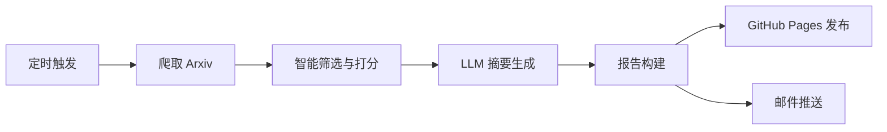

# **📚 LLM4ArxivPaper — 基于 LLM 的 Arxiv 论文自动推送器**

**LLM4ArxivPaper** 是一个基于用户研究兴趣自动爬取、筛选、总结并生成论文报告的智能化工具。

项目会定期从 Arxiv 获取与你研究方向相关的最新论文，利用 LLM 自动生成摘要，并通过 **GitHub Pages** 构建可浏览的每周报告，同时支持 **邮件推送** 功能。

支持 **中英文报告生成**，可实现从自动爬取 → 智能筛选 → LLM 总结 → 报告生成 → 邮件推送 的完整流程。

示例 Demo：[查看这里](https://yeren66.github.io/LLM4ArxivPaper)

> [Switch to English (README.md)](README.md)
---

## **🚀 快速开始（约 10 分钟）**

### **1. Fork 仓库**

将本项目 **Fork** 到你的个人 GitHub 账户下。

### **2. 启用 GitHub Pages**

在你的仓库中创建 Pages 站点，参考官方指南：

👉 [创建 GitHub Pages 站点](https://docs.github.com/en/pages/getting-started-with-github-pages/creating-a-github-pages-site)

### **3. 配置 pipeline.yaml**

修改根目录下的 pipeline.yaml 文件，最小可运行的核心配置如下（yaml文件中已有详细注释）：

```yaml
language: "zh-CN"  # 报告生成语言（可选 zh-CN / en）
topics:
  - name: "software_testing"  
    label: "software testing" # name和label用于构建报告
    query: 
      categories: ["cs.SE", "cs.AI"]               # Arxiv 分类
      include: ["software testing", "test automation"]  # 包含关键词
      exclude: ["quantum", "biomedical"]           # 排除关键词
    interest_prompt: |
      我关注大语言模型辅助软件测试的研究，尤其关注测试生成、覆盖率提升和缺陷定位方面的最新方法。
      
recipients: ["xxx@example.com"]                    # 邮件接收者列表（可多个）
base_url: "https://<github_username>.github.io/LLM4ArxivPaper"  # GitHub Pages 网址
```

> 💡 提示：可以配置多个 topic，项目会分别爬取并生成每个研究方向的报告。

------

### **4. 配置 Secrets**

在仓库中打开：

**Settings → Secrets and Variables → Actions → New repository secret**

填写以下内容：

| **密钥名称**  | **说明**                      | **是否必需**   |
| ------------- | ----------------------------- | -------------- |
| API_KEY       | LLM 服务的 API 密钥           | ✅              |
| BASE_URL      | LLM API 端点（默认为 OpenAI） | ✅              |
| MAIL_USERNAME | Gmail 邮箱账户（完整邮箱地址）   | ⚠️ 邮件功能需要 |
| MAIL_PASSWORD | Gmail 应用专用密码            | ⚠️ 邮件功能需要 |

> 📧 [获取 Gmail 应用密码](https://support.google.com/mail/answer/185833)

如果不启用邮件功能，可省略 MAIL_USERNAME 和 MAIL_PASSWORD，

执行完成后可直接在 base_url 地址（https://<github_username>.github.io/LLM4ArxivPaper）访问生成的报告。

------

### **5. 启用 GitHub Actions**

在仓库中进入 **Settings → Pages**，将 **Source** 选择为 **GitHub Actions**。

------

### **6. 运行脚本**

可手动触发 workflow（pipeline-smoke）进行测试，

或等待每周一自动执行（可在 .github/workflows/weekly-pipeline.yml 中修改执行时间）。

---

## **💼 工作原理**

项目每周自动执行一次以下流程：

1. 根据用户配置的研究主题，从 Arxiv 爬取最近一周的新论文；
2. 对论文进行智能筛选（基于标题、作者、摘要等信息），从新颖性、完整性等方面评分；
3. 筛除低于 60 分的论文；
4. 调用 LLM 对选定论文进行五维度总结；
5. 生成可阅读的报告页面，并自动推送至 GitHub Pages；
6. （可选）将报告以邮件形式发送给指定收件人。

### **📄 LLM 总结模板示例**

```
请从以下 5 个方面帮我总结这篇论文：
1. 主要解决了什么问题？
2. 提出了什么解决方案？
3. 核心方法/策略是什么？（详细说明）
4. 实验设计如何？Metrics、baseline 和 dataset 是什么？
5. 论文的结论是什么？
```

LLM 在总结后还会根据用户的研究兴趣自动生成若干“延伸问题”并尝试回答，以提供更贴合研究方向的洞见。

### **⚙️ 系统流程图**



---

## **🤝 参与贡献**

欢迎提交 Issue 或 Pull Request！

1. Fork 本仓库
2. 创建特性分支：git checkout -b feature/AmazingFeature
3. 提交更改：git commit -m 'Add some AmazingFeature'
4. 推送分支：git push origin feature/AmazingFeature
5. 发起 Pull Request 🎉

------

## **📄 License**

本项目采用 **MIT 协议**

详情请参见 [LICENSE](LICENSE)。

------

## **🙏 致谢**

- [Arxiv](https://arxiv.org/) — 论文数据来源
- [GitHub Actions](https://github.com/features/actions) — 自动化执行平台
- [OpenAI](https://openai.com) — 提供 强大的LLM 支持（虽然API得自己花钱）

