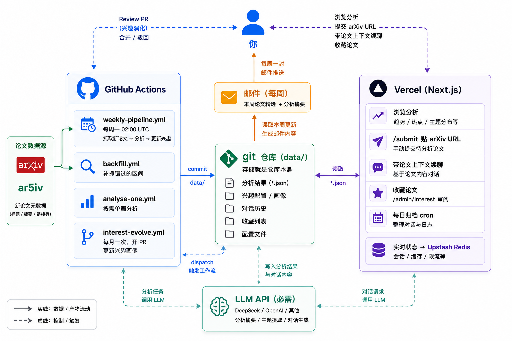
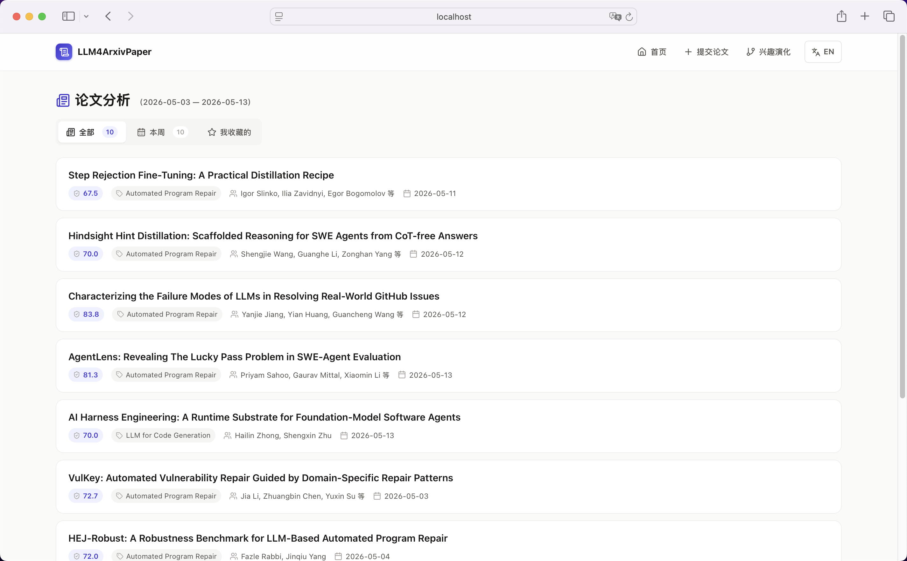
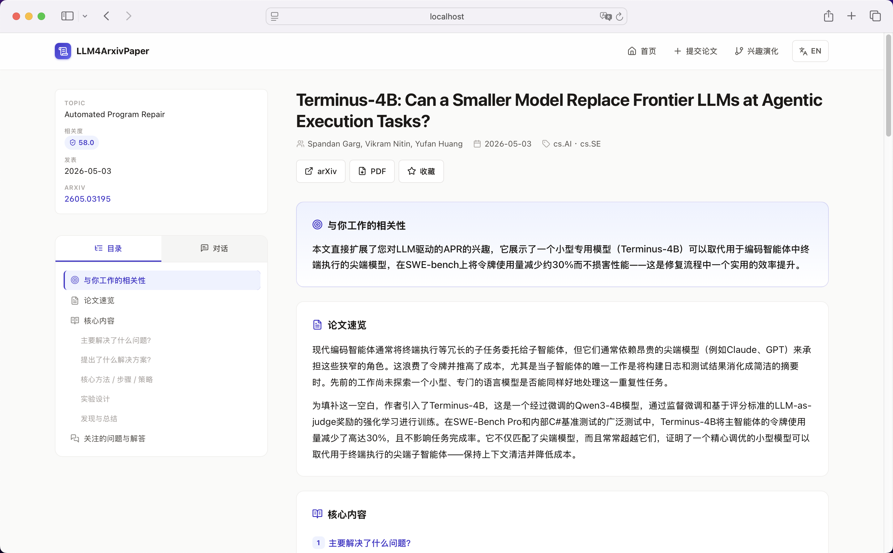
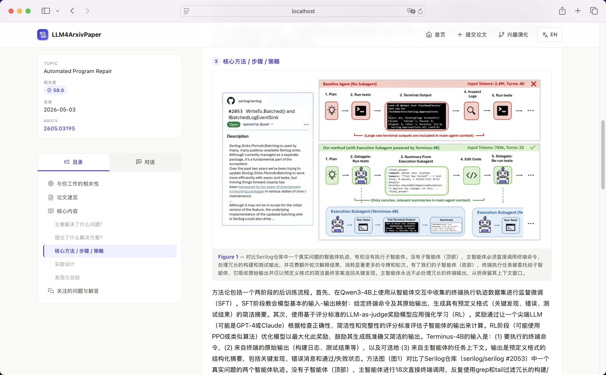

# LLM4ArxivPaper


[English](../README.md)

LLM4ArxivPaper 按你的研究方向抓取 arXiv 论文，用 LLM 做针对你兴趣的深度分析，结果通过一个 web 应用和每周邮件呈现。它分两部分：一条跑在 GitHub Actions 上的分析流水线，和一个部署在 Vercel 上的 Next.js 应用。



## 功能

- 兼容任何 OpenAI 格式端点（DeepSeek / OpenAI / 百炼 / 本地 vLLM），正文走 ar5iv，token 成本极低
- 相关性分析：每篇先用一两句说清它和你研究方向的关系
- 五维深度分析（问题 / 方案 / 方法 / 实验 / 结论）+ 带引文的兴趣问答
- 关键图示自动抽取（架构图、流程图）
- 按 URL 即时分析，带完整论文上下文的对话，历史跨设备同步
- 收藏想留的论文；不感兴趣的可以隐藏
- 补抓任意历史日期区间
- 心跳提交规避 GitHub 60 天无活动自动停用定时任务

## 截图

首页列出所有已分析的论文，三个 tab 分别是全部、本周这次抓取、以及你收藏的：



每篇论文页开头是相关性分析（这篇和*你*的研究有什么关系）和论文速览：



往下是五维深度分析。方法 / 架构图直接从论文里抽出来，嵌在「核心方法」那一维里：



## 安装

```bash
# 1. 用本仓库的 "Use this template" 创建你自己的私有仓库，clone 下来
# 2. 本地验证 LLM 配置（约 1-2 分钟）
pip install -r requirements.txt
API_KEY="sk-..." BASE_URL="https://api.deepseek.com/v1" \
  python src/main.py run --paper-limit 1
```

`--paper-limit 1` 让每个 topic 只分析一篇。终端会显示抓取、评分、五维分析的过程，结束后 `data/analyses/` 下生成 JSON 文件。这一步跑通，说明 LLM key、端点、topic 配置都正确。

接着在 GitHub 上配置：

1. **Settings → Secrets and variables → Actions** 添加 `API_KEY` 和 `BASE_URL`。
2. **Settings → Actions → General** 允许工作流运行。
3. 编辑 `config/pipeline.yaml` 填你的研究方向：

```yaml
openai:
  api_key: "${API_KEY}"
  base_url: "${BASE_URL}"
  relevance_model: "deepseek-v4-flash"
  summarization_model: "deepseek-v4-flash"
  language: "zh-CN"          # 分析内容的输出语言：zh-CN 或 en

topics:
  - name: "software_testing"
    label: "软件测试"
    query:
      categories: ["cs.SE", "cs.AI"]
      include: ["test generation", "test update"]
      exclude: ["quantum"]
    interest_prompt: |
      我研究 LLM 辅助的软件测试，关注测试用例生成与缺陷定位。
      我想理解 LLM 与静态分析如何有效结合。
```

4. **Actions → Weekly LLM4ArxivPaper Pipeline → Run workflow** 跑第一次完整运行。

流水线的产出是 `data/analyses/*.json`，提交进你的仓库。这些 JSON 是 web 应用和邮件的数据源。`language` 控制所有 LLM 生成内容的语言，在生成时生效。

## 部署 web 应用

web 应用提供浏览、按 URL 分析、对话、收藏，以及隐藏你不感兴趣的论文。它跑在 Vercel 上。

1. 注册 [Vercel](https://vercel.com)，导入你的仓库为一个 project。
2. 项目 **Settings → General → Root Directory** 改为 `web`。
3. 项目 **Storage → Browse Marketplace → Upstash Redis → Install**。Redis 存收藏和对话历史，连接环境变量会自动注入。
4. 创建一个 GitHub [fine-grained PAT](https://github.com/settings/tokens?type=beta)，权限：`Actions: Read and write`、`Contents: Read and write`、`Metadata: Read`，只授权给你的实例仓库。
5. 项目 **Settings → Environment Variables** 添加：

| 变量 | 值 | 必需 |
|---|---|---|
| `LLM_API_KEY` | 同 `API_KEY` | 是 |
| `ADMIN_TOKEN` | 自取的长随机串，登录用 | 是 |
| `GH_DISPATCH_TOKEN` | 上一步的 PAT | 是 |
| `LLM_BASE_URL` | LLM 端点 | 否，默认 DeepSeek |
| `LLM_MODEL` | 模型 id | 否，默认 `deepseek-v4-flash` |
| `ARCHIVE_CHATS` | 仓库私有时设 `true` | 否，默认 `false` |

Redis 连接变量由第 3 步自动注入，仓库 owner / name 由 Vercel 的 git 集成自动推导。

Vercel 在 push 后自动部署。打开部署 URL，进 `/login` 粘贴 `ADMIN_TOKEN`，进 `/submit` 贴一个 arXiv 链接，约 2-3 分钟后会跳转到分析页。

## 邮件推送

每周精选发到你的收件箱。

1. 在 Google 账号开启两步验证，生成一个 [Gmail 应用专用密码](https://support.google.com/mail/answer/185833)。
2. 仓库 **Settings → Secrets and variables → Actions** 添加 `MAIL_USERNAME`（Gmail 地址）和 `MAIL_PASSWORD`（应用专用密码）。
3. 在 `config/pipeline.yaml` 填收件人：

```yaml
email:
  enabled: true
  recipients: ["you@example.com"]
```

`MAIL_*` 也用于流水线失败时发告警邮件。换其它邮件服务商改 `email.smtp_host` / `smtp_port`。

## 工作原理

三个 GitHub Actions 工作流：

| 工作流 | 触发 | 作用 |
|---|---|---|
| `weekly-pipeline.yml` | 每周一 02:00 UTC + 手动 | 抓取、评分、分析、提交 `data/`、发邮件，并提交心跳文件保活 |
| `backfill.yml` | 手动 | 按日期区间分块补抓历史论文，`dry_run=true` 先预览数量和成本 |
| `analyse-one.yml` | web 应用 `/submit` 触发，或手动 | 抓取并分析单篇论文 |

每篇抓到的论文都会按 `interest_prompt` 做 0-100 的相关度评分。只有达到或超过 `relevance.pass_threshold`（默认 60）的论文才会做完整的深度分析，其余直接丢弃，把 LLM 预算留给真正对口的论文。你自己通过 `/submit` 提交的论文一律会分析，并照常显示真实得分。

存储就是仓库本身，分析结果是 `data/` 下的 JSON 文件，不需要外部数据库。收藏和对话这类实时状态放在 Upstash Redis，每天由一个 cron 快照回仓库作备份。

## 自定义

### 改每周运行时间

编辑 `.github/workflows/weekly-pipeline.yml` 顶部的 cron 表达式（五字段为「分 时 日 月 周」，时间是 UTC）：

```yaml
on:
  schedule:
    - cron: '0 2 * * 1'    # 每周一 02:00 UTC
```

| 想要的效果 | cron |
|---|---|
| 每周一北京时间早 8 点（UTC+8） | `0 0 * * 1` |
| 每天早上 | `0 0 * * *` |
| 每周一和周四 | `0 2 * * 1,4` |

也可以随时到 Actions 页面手动 **Run workflow** 立即跑。

### 补抓历史论文

到 **Actions → Backfill arXiv Papers → Run workflow**，参数：

- `start_date` / `end_date`：日期区间，`YYYY-MM-DD`。
- `chunk_days`：把区间切成多少天一段（默认 7）。
- `paper_limit`：每个 topic 每段最多分析多少篇，控制成本。
- `dry_run`：第一次设 `true`，只统计候选论文数、不调 LLM、不花钱。看清数量后再设 `false` 真跑。

真实运行会把补抓的分析提交进 `data/`，已分析过的论文自动跳过。

### 调整抓取和筛选

`config/pipeline.yaml`：

| 字段 | 作用 |
|---|---|
| `fetch.days_back` | 每周回看多少天的论文（默认 7） |
| `fetch.max_papers_per_topic` | 每个 topic 最多抓多少篇候选 |
| `relevance.pass_threshold` | 相关度阈值，低于此分不写深度分析（默认 60） |
| `summarization.max_content_chars` | 喂给 LLM 的正文最大字数 |
| `topics` | 增删研究方向，每个有自己的 `query` 和 `interest_prompt` |
| `email.recipients` | 邮件收件人列表 |

## 隐私

你的实例仓库存放分析、收藏、对话历史，把它设为 Private。实时状态在你自己的 Upstash 账号里。数据不经过任何第三方服务。

Vercel 部署是一个公开 URL，拿到链接的人都能浏览。写操作（提交论文、收藏）需要 `ADMIN_TOKEN` 登录，未登录访客只能只读。要连浏览都限制，用 Vercel 的 [Deployment Protection](https://vercel.com/docs/security/deployment-protection)。

公开实例可用 `ARCHIVE_STARS` / `ARCHIVE_CHATS` 控制哪些数据快照进 git：收藏默认归档，对话默认只留在 Redis。

## 成本

DeepSeek V4 Flash 下每篇论文分析约 $0.01–0.05，一次每周运行分析 20-40 篇，总成本远低于 $1。GitHub Actions、Vercel、Upstash 的免费额度对单用户实例都绰绰有余。重计算放在 GitHub Actions（6 小时 job 上限），Vercel 只做轻量 UI 和 API。

## 常见问题

**定时工作流跑了两个月就停了。** GitHub 在仓库 60 天无活动后会自动停用定时工作流。每周运行会提交心跳文件规避。如果已经被停用，去 Actions 页面手动重新启用一次，之后心跳会一直维持。

**`/submit` 报 `403 Resource not accessible by personal access token`。** PAT 缺 `Actions: Read and write`。fine-grained PAT 创建后不能改权限，用正确权限重新生成一个。

**能不能不用 Vercel？** 能。安装 + 邮件推送就是一条完整的无-Vercel 路径，流水线每周分析、精选进收件箱。失去的是对话、按 URL 分析、收藏。

**某篇论文没有「关键图示」。** 图来自 ar5iv 的 HTML 渲染。ar5iv 没收录的论文（太新、或无 LaTeX 源）会降级为无图，分析其它部分照常。

## 项目结构

```
src/                       Python 流水线（跑在 GitHub Actions）
  fetchers/                arXiv API + ar5iv HTML / 图片 / PDF 抽取
  filters/                 LLM 相关度评分
  summaries/               核心分析流水线
  storage/                 写 data/*.json
  publisher/               邮件摘要
  workflow/                CLI 与编排
web/                       Next.js 应用（跑在 Vercel）
config/pipeline.yaml       研究方向 + 兴趣 + 模型配置
data/                      分析、收藏、对话（JSON 文件）
.github/workflows/         四个工作流
docs/                      README_zh.md 及其他文档
pics/                      截图和工作流图
```

## 贡献

欢迎 Issue 和 PR。Python 与 TypeScript 两端的契约是 `src/workflow/pipeline.py` 里 `_summary_to_payload` 写出、`web/lib/data-reader.ts` 读取的 JSON 结构，改字段时两端一起改。

## 许可

MIT，见 [LICENSE](LICENSE)。
